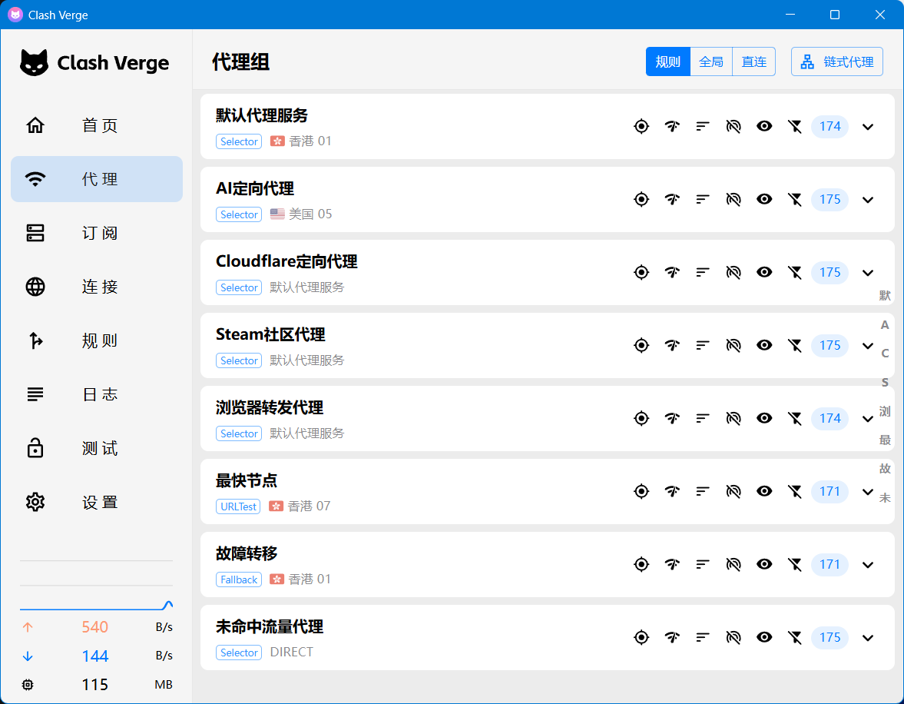

# daily-software-kit · 日用合集

个人日用软件配置搜集库，按主题分目录。

## 目录

- [clash](#clash) · 代理分流（脚本 + ZeroOmega）

---

## clash

机场自带规则经常太粗：Steam 全走代理、不认识的网站也全走代理。这里换成一套更省事的分流：

- AI 网站单独走代理（可指定美国等节点）
- Steam 社区网页走代理，下载和游戏本身直连
- 需要翻墙的域名走主代理
- 其他默认直连
- 浏览器里还是打不开的，用 ZeroOmega 手动强制走代理

### 效果预览

选好节点之后，代理组大致长这样（**不是一导入就这样**，要自己进每个组去选）：

### 里面有什么

| 文件 | 干什么用 |
|------|----------|
| `clash全局扩展脚本-v1.1.txt` | 贴进 Clash 客户端的脚本 |
| `clash全局扩展覆写配置示例.txt` | 想自己加/删规则时参考 |
| `clash脚本说明.txt` | 几句设计备注 |
| `ZeroOmegaOptions-v1.bak` | 浏览器插件配置备份，直接导入 |

相关文件都在 [`clash/`](clash/) 目录里。

### 怎么用

**Clash 客户端**（Clash Verge Rev、Mihomo Party 等，名字因软件而异）：

1. 找到配置里的「全局扩展脚本」之类选项
2. 把 `clash全局扩展脚本-v1.1.txt` 全文粘贴进去并保存，更新订阅
3. 打开「代理」页面，**点进每一个策略组，自己选节点**  
   脚本只会建好这些组，不会替你选好  
   例如：默认代理选常用节点，AI 定向可以单独选美国，未命中流量一般保持直连

**想自己加规则时**，看 `clash全局扩展覆写配置示例.txt`，按示例写就行。

**浏览器（ZeroOmega）**：

1. 安装 [ZeroOmega](https://github.com/zero-peak/ZeroOmega)
2. 导入 `ZeroOmegaOptions-v1.bak`（端口已经配好，不用再改）
3. 平时用自动判断即可
4. 遇到打不开的网站：
   - **临时**：扩展图标切到「强制代理」，用完再切回去
   - **长期**：在规则里给这个网站加条件，让它一直走强制代理

### 客户端里会看到的策略组

导入后会出现下面这些组，需要分别进去选节点：

| 名字 | 用途 |
|------|------|
| 默认代理服务 | 平时翻墙用的主入口，先在这里选一个常用节点 |
| AI定向代理 | AI 相关网站，可单独选美国等节点 |
| Cloudflare定向代理 | 浏览器里 Cloudflare 相关流量，一般跟默认代理即可 |
| Steam社区代理 | Steam 社区页、头像等，一般跟默认代理即可 |
| 浏览器转发代理 | ZeroOmega「强制代理」走这一组，一般跟默认代理即可 |
| 最快节点 | 自动测延迟选最快的，不用手选 |
| 故障转移 | 节点挂了自动换，不用手选 |
| 未命中流量代理 | 没匹配到规则的流量，一般保持直连 |
